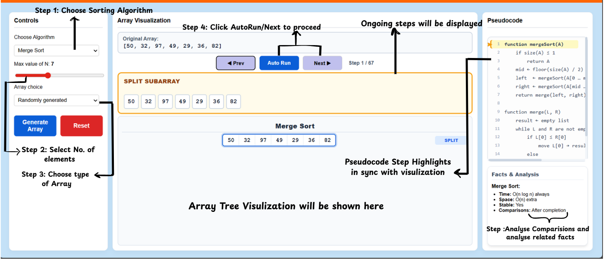

### Procedure

1. Open the **Divide and Conquer Simulation** experiment.
2. From the **Algorithm** dropdown menu, select the sorting algorithm to be analyzed:
   - Merge Sort
   - Quick Sort(Median-of-Three)
3. Adjust the value of **N** (number of elements in the array) using the slider or input control provided.
4. Select the size of an array and the type of input to test different scenarios:
   - **Random Array**: Generates a shuffled list of numbers.
   - **Already Sorted (Ascending)**: Tests best-case/specific scenarios.
   - **Already Sorted (Descending)**: Tests worst-case performance.
   - **Custom Input**: Allows you to enter your own numbers (comma-separated, max 20).

5. Click the **Generate Array** button to start analysing visualization.

### Simulation & Controls

6. **Interactive Navigation**:
   - Use the **Next** button to step forward through the algorithm's decisions.
   - Use the **Prev** button to go back and re-analyze a specific split or merge.
   - Click **Auto Run** to watch the sorting process automatically. You can choose the speed (**Slow, Normal, Fast**).

7. **Pseudocode Sync**:
   - As you step through, observe the **Pseudocode** panel on the right. The currently executing line(s) will be highlighted in yellow.
   - The panel automatically scrolls to keep the active logic in view.

### Visualisation Details

8. The **Middle Panel** displays the current ongoing step and operation details (comparisons, pivots, swaps).
9. Below the main screen controls, the **Tree Visualisation** shows the recursive divide-and-conquer steps in a diamond layout. Each level of recursion is mapped horizontally, with arrows indicating the flow of data during splitting and merging.

### Result and Reset

10. **Facts & Analysis**: The right panel displays real-time runtime metrics:
    - **Comparison Count**: Updates dynamically as you step through.
    - **Complexity Theory**: Displays average and worst-case time complexities as well as space requirements for the selected algorithm.
11. **Reset**: Click the **Reset** button to clear the current simulation and repeat the experiment with a different configuration.